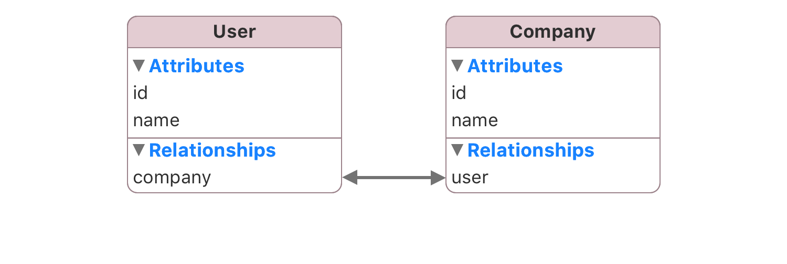

SwiftSync is a sync layer for SwiftData apps.

Define your models once, read from local SwiftData, and let SwiftSync handle the repetitive sync and export work in between.

## Features

- Convention-first JSON -> SwiftData mapping
- Deterministic diffing for inserts, updates, and deletes
- Automatic relationship syncing for nested objects and foreign keys
- Export back into API-ready JSON
- Reactive local reads for SwiftUI and UIKit

## Quick Start

### One-to-many


```swift
import SwiftData
import SwiftSync

@Syncable
@Model
final class User {
  @Attribute(.unique) var id: Int
  var email: String?
  var createdAt: Date?
  var updatedAt: Date?
  var notes: [Note]

  init(id: Int, email: String? = nil, createdAt: Date? = nil, updatedAt: Date? = nil, notes: [Note] = []) {
    self.id = id
    self.email = email
    self.createdAt = createdAt
    self.updatedAt = updatedAt
    self.notes = notes
  }
}

@Syncable
@Model
final class Note {
  @Attribute(.unique) var id: Int
  var text: String
  var user: User?

  init(id: Int, text: String, user: User? = nil) {
    self.id = id
    self.text = text
    self.user = user
  }
}
```

#### JSON

```json
[
  {
    "id": 6,
    "email": "shawn@ovium.com",
    "created_at": "2014-02-14T04:30:10+00:00",
    "updated_at": "2014-02-17T10:01:12+00:00",
    "notes": [
      {
        "id": 301,
        "text": "Call supplier before Friday"
      },
      {
        "id": 302,
        "text": "Prepare Q1 budget review"
      }
    ]
  }
]
```

#### Sync

Create the container:

```swift
let syncContainer = try SyncContainer(for: User.self, Note.self)
```

Then sync the payload:

```swift
let payload = try await getUsers()
try await syncContainer.sync(payload: payload, as: User.self)
```

#### SwiftUI reacts automatically using @SyncQuery

```swift
import SwiftUI
import SwiftSync

struct UsersView: View {
  let syncContainer: SyncContainer

  @SyncQuery(
    User.self,
    in: syncContainer,
    sortBy: [SortDescriptor(\User.id)]
  )
  private var users: [User]

  var body: some View {
    List {
      ForEach(users) { user in
        Section(user.email ?? "User \\(user.id)") {
          ForEach(user.notes) { note in
            Text(note.text)
          }
        }
      }
    }
  }
}
```

### One-to-one



#### Model

```swift
import SwiftData
import SwiftSync

@Syncable
@Model
final class User {
  @Attribute(.unique) var id: Int
  var name: String
  var company: Company?

  init(id: Int, name: String, company: Company? = nil) {
    self.id = id
    self.name = name
    self.company = company
  }
}

@Syncable
@Model
final class Company {
  @Attribute(.unique) var id: Int
  var name: String
  var user: User?

  init(id: Int, name: String, user: User? = nil) {
    self.id = id
    self.name = name
    self.user = user
  }
}
```

#### JSON

```json
[
  {
    "id": 6,
    "name": "Shawn Merrill",
    "company": {
      "id": 0,
      "name": "Facebook"
    }
  }
]
```

#### Sync

```swift
let syncContainer = try SyncContainer(for: User.self, Company.self)

let payload = try await getUsers()
try await syncContainer.sync(payload: payload, as: User.self)
```

#### SwiftUI reacts automatically using @SyncQuery

```swift
import SwiftUI
import SwiftSync

struct UsersView: View {
  let syncContainer: SyncContainer

  @SyncQuery(
    User.self,
    in: syncContainer,
    sortBy: [SortDescriptor(\User.id)]
  )
  private var users: [User]

  var body: some View {
    List(users) { user in
      VStack(alignment: .leading, spacing: 4) {
        Text(user.name)
        Text(user.company?.name ?? "No company")
          .foregroundStyle(.secondary)
      }
    }
  }
}
```

## Install

Add the package in Xcode:

1. `File` -> `Add Package Dependencies...`
2. Use this URL:

```text
https://github.com/3lvis/SwiftSync.git
```

3. Add the `SwiftSync` library product to your app target.

If you use `Package.swift` directly:

```swift
.package(url: "https://github.com/3lvis/SwiftSync.git", from: "1.0.0")
```

Then import:

```swift
import SwiftSync
```

Requirements: Xcode 17+, Swift 6.2, iOS 17+ / macOS 14+

## Full Overview

Quick Start already covers the default root-collection path.

The sections below cover the next cases you are likely to hit in a real app:

- One-to-many relationships linked by IDs instead of nested child objects
- Parent-scoped sync for child collections returned under one parent
- Single-item sync for detail payloads and mutation responses
- Relationship payload shapes beyond the simple nested to-many example
- Customization points for mapping, reads, export, and dates

Table of contents:

- [One-to-Many w/ child IDs](#one-to-many-w-child-ids)
- [Parent-Scoped Sync](#parent-scoped-sync)
- [Single-Item Sync](#single-item-sync)
- [Property Mapping and Customization](#property-mapping-and-customization)
- [Reactive Reads](#reactive-reads)
- [Exporting JSON](#exporting-json)
- [Date Handling](#date-handling)
- [Demo App](#demo-app)
- [Further Reading](#further-reading)
- [License](#license)

## One-to-Many w/ child IDs

Use this shape when the parent JSON does not include full child objects and only sends their IDs.

### Model

```swift
@Syncable
@Model
public final class Project {
  @Attribute(.unique) public var id: String
  public var name: String
  public var tasks: [Task]
}

@Syncable
@Model
public final class Task {
  @Attribute(.unique) public var id: String
  public var title: String

  @NotExport
  public var project: Project?
}
```

### JSON

```json
[
  {
    "id": "C3E7A1B2-1001-0000-0000-000000000001",
    "name": "Account Security Controls",
    "task_ids": [
      "C3E7A1B2-3001-0000-0000-000000000001",
      "C3E7A1B2-3001-0000-0000-000000000002"
    ]
  }
]
```

### Sync

```swift
try await syncContainer.sync(payload: payload, as: Project.self)
```

This works when those tasks already exist in SwiftData, or are synced elsewhere. SwiftSync uses the `*_ids` list to connect the relationship without needing full task objects in the same JSON.

### Read

```swift
@SyncModel(Project.self, id: projectID, in: syncContainer)
private var project: Project?
```

This pattern is useful for APIs that return lightweight parent objects and keep the full child records on a separate endpoint.

## Parent-Scoped Sync

Use parent-scoped sync when an endpoint returns the children for a single parent, such as `/projects/{id}/tasks`.

### Model

```swift
@Syncable
@Model
public final class Task {
  @Attribute(.unique) public var id: String
  public var title: String
  public var projectID: String

  @NotExport
  public var project: Project?
}
```

### JSON

```json
[
  {
    "id": "C3E7A1B2-3001-0000-0000-000000000001",
    "title": "Add session timeout controls to account settings",
    "project_id": "C3E7A1B2-1001-0000-0000-000000000001"
  }
]
```

### Sync

```swift
try await syncContainer.sync(
  payload: payload,
  as: Task.self,
  parent: project,
  relationship: \Task.project
)
```

The explicit `relationship:` key path tells SwiftSync which parent these rows belong to. It compares changes only inside that parent’s set of rows, not across the whole table.

### Read

```swift
let taskPublisher = SyncQueryPublisher(
  Task.self,
  relationship: \Task.project,
  relationshipID: projectID,
  in: syncContainer
)
```

See [Parent Scope](docs/project/parent-scope.md) for the full rules.

## Single-Item Sync

Use `sync(item:)` when an endpoint returns one model at a time, such as a detail screen or the response from saving an edit.

It also works well when that same response includes child data that belongs to that one model.

### Model

```swift
@Syncable
@Model
public final class Item {
  @Attribute(.unique) public var id: String
  public var title: String
  public var taskID: String

  @NotExport
  public var task: Task?
}
```

### JSON

```json
{
  "id": "C3E7A1B2-3001-0000-0000-000000000001",
  "title": "Add session timeout controls to account settings",
  "items": [
    {
      "id": "C3E7A1B2-4001-0000-0000-000000000001",
      "task_id": "C3E7A1B2-3001-0000-0000-000000000001",
      "title": "Document requirements"
    }
  ]
}
```

### Sync

```swift
try await syncContainer.sync(item: payload, as: Task.self)
try await syncContainer.sync(
  payload: itemPayload,
  as: Item.self,
  parent: task,
  relationship: \Item.task
)
```

### Read

```swift
@SyncModel(Task.self, id: taskID, in: syncContainer)
private var task: Task?
```

This keeps the detail flow simple:

- Update the task from the single-object response
- Update that task's checklist items from the nested array
- Let both list and detail screens keep reading from the same SwiftData data

## Property Mapping

Convention-first mapping is the default. Reach for overrides only when local naming intentionally differs from the backend.

Let's say you have a `Task` model. The backend sends a top-level `description` field and a nested `state` object, but you want the local model to stay straightforward and Swift-friendly:

```json
{
  "id": 42,
  "title": "Ship README rewrite",
  "description": "Tighten up the property mapping docs and examples.",
  "state": {
    "id": "in_progress",
    "label": "In Progress"
  }
}
```

You can keep `title` convention-based, rename `description` locally, and flatten the nested `state` object into plain properties on `Task`:

```swift
@Syncable
@Model
final class Task {
  @Attribute(.unique) var id: Int
  var title: String

  @RemoteKey("description")
  var details: String?

  @RemoteKey("state.id")
  var state: String

  @RemoteKey("state.label")
  var stateLabel: String

  init(
    id: Int,
    title: String,
    details: String? = nil,
    state: String,
    stateLabel: String
  ) {
    self.id = id
    self.title = title
    self.details = details
    self.state = state
    self.stateLabel = stateLabel
  }
}
```

In that example:

- `title` needs no annotation because the local name already matches the backend key
- `details` maps back to `description`, which avoids overloading a common Swift model property name
- `state` reads from `state.id`, so your app can work with a flat status identifier
- `stateLabel` reads from `state.label`, which keeps the display string available without storing a nested type locally

Use these annotations when you need them:

- Rely on convention when names already line up
- Use `@RemoteKey` when the local property name intentionally differs
- Use deep paths when the backend nests values but your local model should stay flat
- Use `@PrimaryKey` or `@PrimaryKey(remote:)` when identity is not `id`
- Use `@NotExport` when a property should not be written back out

See [Property Mapping Contract](docs/project/property-mapping-contract.md) for the complete mapping rules.

## Reactive Reads

SwiftSync is built around local reactive reads. That means your views do not fetch directly from the network and then hold onto that response as UI state. Instead, sync writes backend changes into SwiftData, and the UI reads from SwiftData as its source of truth.

The "reactive" part is that those reads stay fresh automatically. When a sync updates the local store, `@SyncQuery` and `@SyncModel` observe the relevant changes, refetch from the local container, and let SwiftUI re-render with current data.

This is the core pattern:

- Sync or mutation code writes backend results into the local `SyncContainer`
- Screens read from the local store instead of reading from transport responses
- The UI updates when the local rows it depends on change

Use `@SyncQuery` for list reads and `@SyncModel` for detail reads:

```swift
@SyncQuery(
  Task.self,
  in: syncContainer,
  sortBy: [
    SortDescriptor(\Task.updatedAt, order: .reverse),
    SortDescriptor(\Task.id)
  ]
)
var tasks: [Task]
```

For one row by ID, use `@SyncModel`:

```swift
@SyncModel(Task.self, id: taskID, in: syncContainer)
var task: Task?
```

For rows that belong to one parent, pass `relationship` and `relationshipID` so the query stays scoped to that relationship path:

```swift
@SyncQuery(
  Task.self,
  relationship: \.project,
  relationshipID: projectID,
  in: syncContainer,
  sortBy: [SortDescriptor(\Task.id)]
)
var tasks: [Task]
```

UIKit is supported through `SyncQueryPublisher` and `SyncModelPublisher`, with the same idea: read locally, let sync update the store, and let the UI react to store changes.

See [Reactive Reads](docs/project/reactive-reads.md) for the full patterns and tradeoffs.

## Exporting JSON

Use export when a local draft needs to become a request body, usually for create and update flows.

The main surface is object export:

```swift
let body = draft.exportObject(for: syncContainer)
```

That gives you a JSON-ready dictionary using the same key mapping, nested relationship handling, and date formatting rules that sync uses in the other direction.

Typical flow:

- Build or edit a draft locally
- Export that draft right before save
- Send the exported body to your backend
- Sync the backend response back into the container so the UI keeps reading from local state

This is the pattern used in the demo task form as well. Keep the draft isolated while the user edits, export it when they tap save, and let the post-save sync update the shared store.

If your backend expects a different key style or date format, configure the container first:

```swift
let syncContainer = SyncContainer(
  modelContainer,
  keyStyle: .camelCase,
  dateFormatter: formatter
)

let body = draft.exportObject(for: syncContainer)
```

Defaults:

- Snake_case keys
- Relationships included as inline arrays/objects
- ISO-style UTC dates
- Nils exported as `null`

Best practices:

- Export a draft object, not the live screen state from network responses
- Prefer exporting right before create or update requests so the payload reflects the latest local edits
- Treat the exported object as a transport body, then re-sync the confirmed backend response into SwiftData
- Use `@RemoteKey`, `@NotExport`, and container formatting options to keep transport concerns out of your UI code

See [FAQ](docs/project/faq.md) and [Property Mapping Contract](docs/project/property-mapping-contract.md) for more on export.

## Date Handling

SwiftSync handles common API date formats out of the box, so most apps do not need any date setup to get started.

On import, it accepts common ISO8601 variants, date-only strings, `YYYY-MM-DD HH:mm:ss`, fractional seconds, and unix timestamps.

On export, it uses an ISO-style UTC formatter by default. That means the same `SyncContainer` can usually parse backend dates on the way in and emit API-ready dates on the way back out without extra configuration.

If your backend expects a different outbound format, configure the container with a custom `DateFormatter`:

```swift
let syncContainer = SyncContainer(
  modelContainer,
  dateFormatter: formatter
)
```

Use that when the server expects a specific non-default string format for create or update payloads.

## Demo App

The demo app shows the full workflow end to end. It is there to show the pieces working together, not to explain every concept in the README.

It includes:

- Project-scoped task sync
- Task detail sync with nested items
- To-one and to-many relationship updates
- Local reactive reads in SwiftUI and UIKit
- Create/edit flows that export local models back into payloads

Open `SwiftSync.xcworkspace` if you want to see those cases working together in a single app.

## Further Reading

- [Parent Scope](docs/project/parent-scope.md)
- [Property Mapping Contract](docs/project/property-mapping-contract.md)
- [Reactive Reads](docs/project/reactive-reads.md)
- [Backend Contract](docs/project/backend-contract.md)
- [FAQ](docs/project/faq.md)

## License

SwiftSync is released under the [MIT License](LICENSE).
