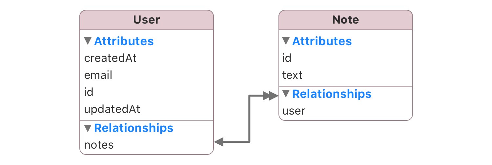

SwiftSync is a sync layer for SwiftData apps.

You define models once, read from local SwiftData, and let SwiftSync handle the repetitive JSON sync/export work in between.

## Features

- Convention-first JSON -> SwiftData mapping
- Deterministic diffing for inserts, updates, and deletes
- Automatic relationship syncing for nested objects and foreign keys
- Export back into API-ready JSON
- Reactive local reads for SwiftUI and UIKit

## Quick Start

### Mark your models as @Syncable



```swift
import SwiftData
import SwiftSync

@Syncable
@Model
final class User {
  @Attribute(.unique) var id: Int
  var email: String?
  var createdAt: Date?
  var updatedAt: Date?
  var notes: [Note]

  init(id: Int, email: String? = nil, createdAt: Date? = nil, updatedAt: Date? = nil, notes: [Note] = []) {
    self.id = id
    self.email = email
    self.createdAt = createdAt
    self.updatedAt = updatedAt
    self.notes = notes
  }
}

@Syncable
@Model
final class Note {
  @Attribute(.unique) var id: Int
  var text: String
  var user: User?

  init(id: Int, text: String, user: User? = nil) {
    self.id = id
    self.text = text
    self.user = user
  }
}
```

### JSON

```json
[
  {
    "id": 6,
    "email": "shawn@ovium.com",
    "created_at": "2014-02-14T04:30:10+00:00",
    "updated_at": "2014-02-17T10:01:12+00:00",
    "notes": [
      {
        "id": 301,
        "text": "Call supplier before Friday"
      },
      {
        "id": 302,
        "text": "Prepare Q1 budget review"
      }
    ]
  }
]
```

### Setup SwiftSync and call sync with your JSON

In your root:

```swift
let syncContainer = try SyncContainer(for: User.self, Note.self)
```

In your network layer:

```swift
let payload = try await getUsers()
try await syncContainer.sync(payload: payload, as: User.self)
```

### SwiftUI reacts automatically to changes using @SyncQuery

```swift
import SwiftUI
import SwiftSync

struct UsersView: View {
  let syncContainer: SyncContainer

  @SyncQuery(
    User.self,
    in: syncContainer,
    sortBy: [SortDescriptor(\User.email)]
  )
  private var users: [User]

  var body: some View {
    List(users) { user in
      Section(user.email ?? "User \\(user.id)") {
        ForEach(user.notes) { note in
          Text(note.text)
        }
      }
    }
  }
}
```

## Install

Add the package in Xcode:

1. `File` -> `Add Package Dependencies...`
2. Use this URL:

```text
https://github.com/3lvis/SwiftSync.git
```

3. Add the `SwiftSync` library product to your app target.

If you use `Package.swift` directly:

```swift
.package(url: "https://github.com/3lvis/SwiftSync.git", from: "1.0.0")
```

Then import:

```swift
import SwiftSync
```

Requirements: Xcode 17+, Swift 6.2, iOS 17+ / macOS 14+

## Full Overview

Quick Start already covers the default root-collection path.

Overview should cover the next cases you are likely to need in a real app:

- parent-scoped sync for child collections returned under one parent
- single-item sync for detail payloads and mutation responses
- relationship payload shapes beyond the simple nested to-many example
- customization points for mapping, reads, export, and dates

Table of contents:

- [Parent-Scoped Sync](#parent-scoped-sync)
- [Single-Item Sync](#single-item-sync)
- [Property Mapping and Customization](#property-mapping-and-customization)
- [Reactive Reads](#reactive-reads)
- [Exporting JSON](#exporting-json)
- [Date Handling](#date-handling)
- [Demo App](#demo-app)
- [Further Reading](#further-reading)
- [License](#license)

## Parent-Scoped Sync

Use parent-scoped sync when an endpoint returns the children for one parent, like `/projects/{id}/tasks`.

### Model

```swift
@Syncable
@Model
public final class Task {
  @Attribute(.unique) public var id: String
  public var projectID: String
  public var assigneeID: String?
  public var authorID: String
  public var title: String
  public var createdAt: Date
  public var updatedAt: Date

  @NotExport
  public var project: Project?
}
```

### JSON

```json
[
  {
    "id": "C3E7A1B2-3001-0000-0000-000000000001",
    "project_id": "C3E7A1B2-1001-0000-0000-000000000001",
    "author_id": "C3E7A1B2-2001-0000-0000-000000000004",
    "assignee_id": "C3E7A1B2-2001-0000-0000-000000000001",
    "reviewer_ids": ["C3E7A1B2-2001-0000-0000-000000000004"],
    "watcher_ids": [
      "C3E7A1B2-2001-0000-0000-000000000002",
      "C3E7A1B2-2001-0000-0000-000000000005"
    ],
    "title": "Add session timeout controls to account settings",
    "state": {
      "id": "inProgress",
      "label": "In Progress"
    },
    "created_at": "2025-01-01T05:00:00Z",
    "updated_at": "2025-01-01T05:00:00Z"
  }
]
```

### Sync

```swift
try await syncContainer.sync(
  payload: payload,
  as: Task.self,
  parent: project,
  relationship: \Task.project
)
```

The explicit `relationship:` key path is required at the API boundary so the scope is unambiguous. SwiftSync diffs only within that parent scope, not across the whole table.

### Read

```swift
let taskPublisher = SyncQueryPublisher(
  Task.self,
  relationship: \Task.project,
  relationshipID: projectID,
  in: syncContainer,
  sortBy: [
    SortDescriptor(\Task.updatedAt, order: .reverse),
    SortDescriptor(\Task.id)
  ]
)
```

This case is also where you commonly mix relationship payload shapes:

- scalar FK to-one links like `project_id` and `assignee_id`
- to-many ID lists like `reviewer_ids` and `watcher_ids`
- nested objects like `state.id` and `state.label`

Payload semantics remain strict:

- absent key means ignore
- explicit `null` means clear

See [Parent Scope](docs/project/parent-scope.md) for the full contract.

## Single-Item Sync

Use `sync(item:)` when the server returns one authoritative row, usually from a detail endpoint or a mutation response.

That becomes more interesting when the same payload also includes a scoped child collection or many-to-many data.

### Model

```swift
@Syncable
@Model
public final class Item {
  @Attribute(.unique) public var id: String
  public var taskID: String
  public var title: String
  public var position: Int

  @NotExport
  public var task: Task?
}
```

### JSON

```json
{
  "id": "C3E7A1B2-3001-0000-0000-000000000001",
  "project_id": "C3E7A1B2-1001-0000-0000-000000000001",
  "title": "Add session timeout controls to account settings",
  "reviewer_ids": ["C3E7A1B2-2001-0000-0000-000000000004"],
  "watcher_ids": [
    "C3E7A1B2-2001-0000-0000-000000000002",
    "C3E7A1B2-2001-0000-0000-000000000005"
  ],
  "items": [
    {
      "id": "C3E7A1B2-4001-0000-0000-000000000001",
      "task_id": "C3E7A1B2-3001-0000-0000-000000000001",
      "title": "Document requirements",
      "position": 0
    }
  ]
}
```

### Sync

```swift
try await syncContainer.sync(item: payload, as: Task.self)
try await syncContainer.sync(
  payload: itemPayload,
  as: Item.self,
  parent: task,
  relationship: \Item.task
)
```

### Read

```swift
public var task: Task? {
  taskPublisher.row
}

public var items: [Item] {
  itemPublisher.rows
}
```

This is useful when the parent row is globally identifiable but one nested child collection is scoped to the detail payload. The result is:

- `sync(item:)` updates the one task row without treating the payload as a full collection diff
- checklist items are diffed only within that task's scope
- many-to-many relationships like reviewers/watchers can still come from `*_ids` in that same item payload
- list screens and detail screens keep reading from the same local SwiftData state

## Property Mapping and Customization

Convention-first mapping is the default. Add overrides only when local naming intentionally differs from the backend.

`description` is a backend key, but the local property is named `descriptionText`:

```swift
@RemoteKey("description")
public var descriptionText: String?
```

The task state is also modeled as a nested object in the payload while remaining flat in the local model:

```swift
@RemoteKey("state.id")
public var state: String

@RemoteKey("state.label")
public var stateLabel: String
```

Use this section for:

- rely on convention when names already line up
- use `@RemoteKey` when the local property name intentionally differs
- use deep paths when the backend nests values but your local model should stay flat
- use `@PrimaryKey` or `@PrimaryKey(remote:)` when identity is not `id`
- use `@NotExport` when a property should not be written back out

See [Property Mapping Contract](docs/project/property-mapping-contract.md) for the full rules.

## Reactive Reads

SwiftSync is built around local reactive reads: sync updates SwiftData, and the UI reads from the local store.

Use `@SyncQuery` for list reads and `@SyncModel` for detail reads.

```swift
@SyncQuery(
  Task.self,
  in: syncContainer,
  sortBy: [
    SortDescriptor(\Task.updatedAt, order: .reverse),
    SortDescriptor(\Task.id)
  ]
)
var tasks: [Task]
```

For parent-scoped reads, pass `relationship` and `relationshipID`:

```swift
@SyncQuery(
  Task.self,
  relationship: \.project,
  relationshipID: projectID,
  in: syncContainer,
  sortBy: [SortDescriptor(\Task.id)]
)
var tasks: [Task]
```

UIKit is supported via `SyncQueryPublisher` and `SyncModelPublisher`.
See [Reactive Reads](docs/project/reactive-reads.md) for the full patterns and tradeoffs.

## Exporting JSON

Use export when local models need to become API payloads again, usually in create/edit flows.

```swift
let body = draft.exportObject(for: syncContainer)
```

For bulk export:

```swift
let rows = try syncContainer.export(as: User.self)
```

Defaults:

- snake_case keys
- relationships included as inline arrays/objects
- ISO-style UTC dates
- nils exported as `null`

Use a different key style or date formatter by configuring the container:

```swift
let syncContainer = SyncContainer(
  modelContainer,
  keyStyle: .camelCase,
  dateFormatter: formatter
)
let rows = try syncContainer.export(as: User.self)
```

See [FAQ](docs/project/faq.md) and [Property Mapping Contract](docs/project/property-mapping-contract.md) for export details.

## Date Handling

Inbound parsing supports common ISO8601 variants, date-only strings, `YYYY-MM-DD HH:mm:ss`, fractional seconds, and unix timestamps.

Export uses an ISO-style UTC formatter by default.

If your backend needs a different outbound date format, pass a custom `DateFormatter` to `SyncContainer`:

```swift
let syncContainer = SyncContainer(
  modelContainer,
  dateFormatter: formatter
)
```

## Demo App

The demo app is there to show the full workflow end to end, not to teach every concept.

It includes:

- project-scoped task sync
- task detail sync with nested items
- to-one and to-many relationship updates
- local reactive reads in SwiftUI and UIKit
- create/edit flows that export local models back into payloads

Open `SwiftSync.xcworkspace` if you want to see those cases working together in one app.

## Further Reading

- [Parent Scope](docs/project/parent-scope.md)
- [Property Mapping Contract](docs/project/property-mapping-contract.md)
- [Reactive Reads](docs/project/reactive-reads.md)
- [Backend Contract](docs/project/backend-contract.md)
- [FAQ](docs/project/faq.md)

## License

SwiftSync is released under the [MIT License](LICENSE).
